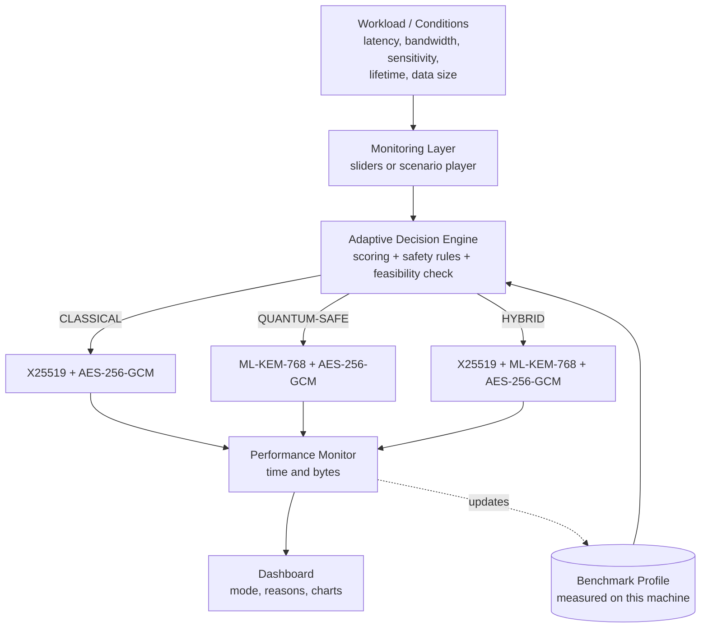

# Adaptive Quantum Cryptography for Low-Latency Hybrid Computing

> A beginner-friendly hackathon implementation guide

**Track 2 — Quantum Security & Cryptography** · Round 1 deadline: **7 October 2026, end of day**

---

## 0. Read This First (2-minute summary)

**Project Summary.** We build a *software prototype* of an **adaptive security framework**. It watches conditions (latency budget, bandwidth, data sensitivity, how long the data must stay secret, data size) and **automatically chooses** one of three security modes:

| Mode | What it means | Used when |
|---|---|---|
| **CLASSICAL** | Today's standard crypto (X25519 key exchange + AES-256-GCM) | Speed matters, data is not very sensitive, network is tight |
| **QUANTUM-SAFE** | Post-quantum key establishment (ML-KEM-768) + AES-256-GCM | Data is very sensitive and must stay secret for years |
| **HYBRID** | Classical + post-quantum together | In-between cases |

**Round 1 MVP (4 features):** (1) Adaptive decision engine, (2) real benchmarking, (3) dashboard, (4) adaptive switching demo.

**Round 2 roadmap (3 upgrades):** (A) calibrated weighted policy engine with explanations, (B) full hybrid key-establishment workflow with signatures, (C) HPC/QC workload profiles and session simulation.

**Architecture in one line:** `Conditions → Decision Engine → Crypto Suite → Benchmark → Dashboard`.

**Honest scope.** We do **not** build a quantum computer and we do **not** do "quantum encryption". "Quantum-safe" here means *post-quantum cryptography (PQC)*: ordinary software algorithms designed to resist attacks from future quantum computers.

> ⚠️ **Deadline reality check.** The date today is 6 October 2026 and Round 1 ends 7 October. You have roughly one and a half days. Everything in Sections 8, 11 and 20 is scoped for that. **Anything labelled Round 2 must NOT be started before you have submitted Round 1.** Also check the official submission format (repo link? video? slides? form?) right now, because that decides what you must produce.

**Section map:** 1 Overview · 2 Problem terms · 3 Crypto basics · 4 Quantum threat · 5 PQC · 6 Engineering view · 7 Architecture · 8 Round 1 MVP · 9 Tech stack · 10 Folders · 11 Step-by-step build · 12 Decision engine · 13 Benchmarking · 14 Demo scenarios · 15 Round 2 · 16 Testing · 17 Security limits · 18 Mistakes · 19 Judge script · 20 Checklist and plan.

---

## 1. Project Overview

**Title:** Adaptive Quantum Cryptography for Low-Latency Hybrid Computing (working name: *AdaptiveCrypt*)

**One-line explanation:** A framework that picks the right type of encryption for each situation, instead of using one fixed type everywhere.

**The problem.** Future quantum computers could break the public-key cryptography that protects most of the internet today. The new "post-quantum" algorithms fix this, but they send **bigger messages** and sometimes take **more time**. In high-performance computing (HPC) connected to quantum computers (QC), some jobs are extremely time-sensitive and others carry extremely sensitive data. One fixed choice is either too slow or not safe enough.

**The solution.** A decision engine that looks at live conditions, picks Classical, Quantum-Safe or Hybrid, runs it, measures the real cost, and shows the reason on a dashboard.

**Target users.** Operators of HPC/QC facilities, research labs sharing data with cloud quantum services, and security teams planning a move to post-quantum cryptography.

**Why it matters.**
- Attackers can **record encrypted data today** and decrypt it later when quantum computers exist ("harvest now, decrypt later").
- PQC has a real cost (bigger keys and messages). Using it blindly everywhere hurts latency-critical jobs.
- Using classical crypto everywhere ignores the long-term threat.
- So the *right answer depends on conditions*. That is our innovation.

**What we demonstrate.** Real cryptography running locally, real measurements, a transparent decision with reasons, and live switching when conditions change.

### 30-second elevator pitch (memorize this)

> "Quantum computers will eventually break today's public-key encryption, and attackers can already record data now to decrypt later. The fix is post-quantum cryptography, but it is heavier: bigger keys, more bandwidth. In HPC and quantum workflows, some jobs can't afford that and others can't risk skipping it. We built an adaptive framework that looks at latency, bandwidth, data sensitivity and data lifetime, then automatically selects classical, quantum-safe or hybrid security. It uses real standardized algorithms, measures real performance on this laptop, and explains every decision on a live dashboard. It's not 'magic quantum encryption' — it's an honest security/performance trade-off engine."

---

## 2. Understanding the Problem Statement

Original statement: **"Adaptive Quantum Cryptography for Low-Latency Hybrid Computing"**. Create a framework that dynamically switches between classical and quantum-safe encryption based on latency, bandwidth, and workload requirements in HPC-QC systems.

Each term below has four parts: definition, "like I'm 12", analogy, why it matters to us.

### 2.1 Adaptive
- **Definition:** A system that changes its behaviour automatically in response to measured conditions.
- **Like I'm 12:** It doesn't do the same thing every time. It looks around and adjusts.
- **Analogy:** A car's automatic gearbox changes gear depending on speed and slope.
- **Why it matters:** This is our core idea. The "gear" is the security mode.

### 2.2 Quantum Cryptography
- **Definition:** Cryptography that uses quantum physics itself (for example, quantum key distribution, QKD, which sends light particles whose state reveals eavesdropping).
- **Like I'm 12:** Locks that rely on the strange rules of tiny particles.
- **Analogy:** A letter that visibly burns if anyone peeks.
- **Why it matters:** The problem title says "quantum cryptography", but it needs special hardware. **We are not doing this.** We say so clearly to avoid a false claim.

### 2.3 Quantum-Safe (Post-Quantum) Cryptography
- **Definition:** Ordinary algorithms, running on normal computers, built on maths problems believed hard even for quantum computers.
- **Like I'm 12:** A new lock design that even a super-powerful future lock-picker can't beat (as far as we know).
- **Analogy:** Upgrading from a lock whose weakness was just discovered by a new tool to a different lock type.
- **Why it matters:** This is what our "Quantum-Safe mode" actually runs.

### 2.4 Low Latency
- **Definition:** Short delay between sending a request and getting the response. Latency is measured in milliseconds (ms).
- **Like I'm 12:** How long you wait after pressing a button before something happens.
- **Analogy:** Delay between you speaking and the other person hearing on a phone call.
- **Why it matters:** Extra crypto work and extra bytes add delay. Our engine has a **latency budget**.

### 2.4b Bandwidth
- **Definition:** How much data a connection can carry per second (kbps, Mbps).
- **Analogy:** Width of a water pipe. Bigger keys are like pushing more water through the same pipe.

### 2.5 Hybrid Computing
- **Definition:** Systems where different kinds of computers work together (here: classical supercomputers plus quantum processors).
- **Like I'm 12:** A team where a strong calculator and a special experimental calculator share a job.
- **Analogy:** A kitchen with a normal oven and a special wood-fire oven, with a chef passing dishes between them.
- **Why it matters:** Data moves between them over networks, and that traffic needs protecting. Note: "hybrid" also appears in *hybrid cryptography* (classical + PQ together). Context tells you which.

### 2.6 HPC (High-Performance Computing)
- **Definition:** Many powerful computers working together on huge calculations (weather, drug discovery, physics).
- **Analogy:** A factory with thousands of workers instead of one.
- **Why it matters:** HPC jobs move big, valuable data and care about speed.

### 2.7 QC (Quantum Computing)
- **Definition:** Computing that uses quantum physics to solve certain problems much faster than normal computers.
- **Analogy:** A specialist who is amazing at certain puzzles but useless for everyday tasks.
- **Why it matters:** It is both the *threat* to current crypto and a *partner* in HPC-QC systems. **We simulate; we need no quantum hardware.**

### 2.8 Cryptographic Framework
- **Definition:** A reusable software structure that organizes crypto choices, operations and policies.
- **Analogy:** Not one lock, but the whole security-office system that decides which lock goes on which door.
- **Why it matters:** Our deliverable is the decision layer plus the crypto it controls.

---

## 3. Cryptography From Zero

**Encryption** scrambles readable data (*plaintext*) into unreadable data (*ciphertext*) so only people with the right **key** can read it. **Decryption** is the reverse.

**Why it exists:** Networks are shared. Anyone along the path could read your data. Encryption makes intercepted data useless.

**Key.** A secret value (a long random number) that controls the scrambling. Algorithms are public; **only the key is secret**.
*Analogy:* Everyone knows how a padlock works. Only the key matters.

### 3.1 Symmetric encryption
Same key locks and unlocks. **AES** is the standard example.
- **Fast**, good for large data.
- **Problem:** how do two parties share the key safely in the first place?

**AES conceptually:** AES processes data in 16-byte blocks. It runs each block through many rounds of mixing and substitution controlled by the key, so the output looks random. We use **AES-256-GCM**: 256-bit key; GCM mode also adds an **authentication tag** so tampering is detected (this is called *authenticated encryption*). You never implement AES yourself; you call a library.

### 3.2 Asymmetric (public-key) encryption
Two linked keys: a **public key** (share freely) and a **private key** (never share). It solves the "how do we share a key" problem. It is slower and is usually used only to set up a symmetric key.
*Analogy:* A mailbox: anyone can drop in a letter (public), only you have the key to open it (private).

### 3.3 Key exchange / key establishment
A method for two parties to end up with the **same secret key** without ever sending it openly.
- Classical: **Diffie-Hellman style** (we use **X25519**).
- Post-quantum: **KEM** (Key Encapsulation Mechanism). One side makes a random secret, "wraps" it using the other's public key, sends the wrapped version (**ciphertext**), and the other side unwraps it.

### 3.4 Digital signatures
Prove **who sent something** and that it **wasn't changed**. Signer uses a private key, anyone verifies with the public key.
*Analogy:* A wax seal only you can stamp, that everyone can recognise.
Classical: Ed25519 / RSA / ECDSA. Post-quantum: ML-DSA.

### 3.5 The standard pattern (important!)

```text
Step 1: Key establishment (asymmetric)  -> both sides get a shared secret key
Step 2: Bulk encryption (AES, symmetric) -> all actual data is encrypted with that key
```

> **Key insight for this project:** AES-256 is used for the data in *all three modes*. What changes is **how the key is established** (X25519 vs ML-KEM vs both). That is where the quantum threat and the overhead live.

---

## 4. Why Quantum Computers Change the Security Problem

**Classical bits** are 0 or 1. **Qubits** can be in a blend of states, and quantum algorithms use interference between those states to solve certain problems with far fewer steps. They are **not** faster at everything; only at specific problems.

**Shor's algorithm (high level).** A quantum algorithm that can break the maths used by **RSA, Diffie-Hellman and elliptic-curve crypto (including X25519, ECDSA, Ed25519)** efficiently. Those schemes rely on problems (factoring, discrete logarithms) that are hard for classical computers but not for a large, error-corrected quantum computer. This is why **public-key crypto is the urgent part**.

**Grover's algorithm (high level).** Speeds up brute-force searching, but only by about a **square root**. Effect: an AES key's effective strength is roughly halved in bits. **AES-128 → ~64-bit**, **AES-256 → ~128-bit**, which is still considered strong. So the standard advice is: *use AES-256 and don't panic about symmetric crypto.* (Grover also parallelizes poorly in practice.)

**Harvest now, decrypt later (HNDL).** An attacker records encrypted traffic today, stores it, and decrypts it years later with a quantum computer.
*Analogy:* Photocopying a locked box you can't open yet, storing the copy, and waiting years until someone invents a tool that opens it.

**Why this matters today.** If your data must stay secret for 10-20 years (medical records, defense, long research programs, financial records), the danger already exists, even if a large quantum computer arrives later. A simple way to think about it (Mosca's rule):

```text
If (years data must stay secret) + (years it takes you to migrate) > (years until quantum computers can break the crypto)
   → you are already at risk.
```

Nobody knows the exact date. **We never claim a date.** Our engine takes `lifetime_years` as an input so the *user* states how long data must remain confidential.

> Reality check: large, fault-tolerant quantum computers that can run Shor on real key sizes do **not** exist today. The concern is future capability plus long-lived data.

---

## 5. Post-Quantum Cryptography

**PQC** = classical-computer algorithms designed to resist known quantum attacks. They are based on different hard problems (for the two we use, **lattice** problems — you don't need the math).

### 5.1 The four terms you MUST keep separate

| Term | What it is | Do we do it? |
|---|---|---|
| **Quantum Computing** | Using quantum physics to compute | No (we only discuss as the threat context) |
| **Quantum Cryptography** | Crypto that uses quantum physics (e.g., QKD) | No |
| **Post-Quantum Cryptography (PQC)** | Normal software algorithms resistant to quantum attacks | **Yes** |
| **Quantum-Safe Security** | The overall goal/strategy of staying secure in the quantum era (PQC + hybrid + good practice) | **Yes (our framework)** |

### 5.2 NIST-standardized algorithms
In August 2024, NIST published the first PQC standards:
- **ML-KEM** (FIPS 203), derived from **CRYSTALS-Kyber**: key establishment.
- **ML-DSA** (FIPS 204), derived from **CRYSTALS-Dilithium**: digital signatures.
- **SLH-DSA** (FIPS 205), derived from SPHINCS+: backup signature approach.

**Why standardization matters:** Years of public attack attempts, agreed parameters, interoperability and compliance. Never invent your own algorithm.

> Names: older libraries call them `Kyber768` / `Dilithium3`, newer ones `ML-KEM-768` / `ML-DSA-65`. Verify your library's exact names (Section 9).

### 5.3 The cost: bigger data
Standard sizes (from the specs; **always confirm by measuring** in your own benchmark):

| Item | Classical | Post-quantum |
|---|---|---|
| Key exchange public key | X25519: 32 bytes | ML-KEM-768: 1,184 bytes |
| Key exchange "reply" | X25519: 32 bytes | ML-KEM-768 ciphertext: 1,088 bytes |
| Signature | Ed25519: 64 bytes | ML-DSA-65: 3,309 bytes |
| Signature public key | Ed25519: 32 bytes | ML-DSA-65: 1,952 bytes |

So a PQ handshake sends roughly **30-35x more bytes**. On a fast network that's trivial. On a slow or constrained link, or for many tiny messages, it matters. PQ operations are often *fast* in computation but heavy in size, so the main cost is often **bandwidth**, not CPU.

---

## 6. Understanding the Actual Hackathon Challenge

Translate the problem statement into an engineering pipeline:

```text
Input (conditions + data)
   ↓
Monitor conditions
   ↓
Evaluate requirements
   ↓
Choose security strategy
   ↓
Perform cryptographic operation
   ↓
Measure performance
   ↓
Display result
```

**What our framework is responsible for:**
1. Accepting conditions (live sliders now; real monitors later).
2. Scoring security need vs performance pressure.
3. Selecting a mode **and explaining why**.
4. Actually running that mode with real libraries.
5. Measuring time and bytes.
6. Showing it all clearly.

**What it is NOT responsible for:** inventing new crypto, real quantum hardware, real network deployment, certificates/PKI, production hardening.

**What is simulated vs real:**

| Real | Simulated |
|---|---|
| Key generation, key establishment, AES encryption/decryption, timings, byte sizes | Network bandwidth and latency conditions, the HPC-QC environment, workload types |

---

## 7. Proposed Solution



**Components:**
- **Monitoring layer:** supplies the condition values. In Round 1, sliders and scripted scenarios stand in for real sensors.
- **Benchmark profile:** a JSON file produced by running real crypto on your laptop. The engine uses *measured* costs to decide, which makes decisions grounded in reality.
- **Decision engine:** pure Python function. Input conditions, output mode + score breakdown + reasons + warnings. Fully testable without crypto.
- **Crypto suite:** three small functions with the same interface, one per mode.
- **Performance monitor:** wraps timing around each operation.
- **Dashboard:** Streamlit page that shows everything.

**Why hybrid works (preview).** In hybrid, the final key is derived from *both* the classical and PQ secrets. An attacker must break **both** to learn the key. If PQC turns out to have a flaw, X25519 still protects against today's attackers; if quantum computers break X25519, ML-KEM still protects. (Full explanation in Section 15.)

---

## 8. ROUND 1 MVP

We will build **4 features**. All run locally in Python.

### Feature 1: Adaptive Security Decision Engine
- **What:** Function `decide(conditions, profile) → Decision`.
- **Why:** The core innovation.
- **How:** Section 12: security-need score minus performance-pressure score, plus a safety floor and a feasibility check using measured costs.
- **User sees:** Mode, scores, human-readable reasons.
- **Steps:** Steps 6-7 in Section 11.
- **Tech:** Pure Python.
- **Done when:** unit tests for all four demo scenarios pass; every decision includes at least one reason string.

### Feature 2: Real Performance Benchmarking
- **What:** Runs each mode N times, records median/mean/p95 time and bytes on the wire.
- **Why:** Proves we measure, not guess.
- **How:** `time.perf_counter()`, repeated runs, JSON output (Section 13).
- **User sees:** Comparison table and chart.
- **Tech:** Python standard library (+ pandas optional).
- **Done when:** `python -m benchmarking.run_benchmarks` creates `benchmarking/results.json` for all three modes.

### Feature 3: Security/Performance Dashboard
- **What:** One-page Streamlit app.
- **Why:** Judges understand the project in 30 seconds.
- **How:** Sliders on the left; on the right a big mode badge, reasons, score bars, estimated handshake time per mode, and a "Run real encryption" button.
- **Tech:** Streamlit.
- **Done when:** changing any slider updates the decision instantly, and the live-encryption button shows ciphertext size and "decrypted correctly: ✅".

### Feature 4: Adaptive Switching Demonstration
- **What:** A scripted timeline of conditions (the four demo scenarios) played step by step.
- **Why:** Visually proves the system is adaptive.
- **How:** `simulation/scenarios.py` holds scenarios; dashboard has a "Scenario player" slider/buttons.
- **Done when:** stepping through the timeline shows the mode change at least 3 times, with reasons.

### Priority table

| Feature | Difficulty | Importance | Demo Value | Must Have? |
| ------- | ---------: | ---------: | ---------: | ---------: |
| 1. Decision engine | Medium | Very high | High | **Yes** |
| 2. Benchmarking | Medium | Very high | High | **Yes** |
| 3. Dashboard | Medium | High | Very high | **Yes** |
| 4. Switching demo | Low-Medium | High | Very high | **Yes** |
| Signatures (ML-DSA vs Ed25519) | Medium | Medium | Medium | No (stretch) |

**Timeline fit:** see Section 20. If time runs short, cut signatures, CPU/memory profiling and any dashboard polish. **Never cut the working end-to-end demo.**

---

## 9. Technology Stack

| Technology | Why are we using this? |
|---|---|
| **Python 3.10+** | Easiest language for a fast prototype; all libraries below support it. Verify your version with `python --version`. |
| **`cryptography` library** | Well-reviewed, maintained library for AES-GCM, X25519 and HKDF. We never write our own crypto. |
| **`liboqs-python` (package name `liboqs-python`, imported as `oqs`)** | Python wrapper for the Open Quantum Safe project's `liboqs`, which implements ML-KEM and ML-DSA. **Verify current install instructions** at the project's GitHub README, because it may need to build the C library (needs `git`, `cmake`, a C compiler) and the algorithm names depend on the version. |
| **Fallback: `kyber-py` and `dilithium-py`** | Pure-Python educational implementations of ML-KEM and ML-DSA. Install with plain `pip`, no compiler. **Slower and not hardened (not constant-time)**, so benchmark numbers are *not* representative of real deployments. Label this honestly if you use them. Verify package names on PyPI. |
| **Streamlit** | Builds an interactive dashboard in about 60 lines of Python. No frontend skills needed. |
| **pandas** | Small tables and charts for the comparison view (optional but handy). |
| **pytest** | Simple automated tests. |
| **JSON file** | Stores benchmark results. No database needed. |
| **SQLite** | **Skip** for Round 1. |
| **Docker** | **Skip.** It would cost time and add nothing to the demo. |
| **React / FastAPI** | **Skip** for Round 1. Streamlit alone is enough. Consider FastAPI only if Round 2 needs an API. |

**Recommendation:** try `liboqs-python` for **at most 30 minutes**. If it fails, switch to the pure-Python fallback and write one honest line in the README: *"PQC backend: kyber-py (educational implementation); timings are indicative only."* A working demo beats a perfect install.

---

## 10. Folder Structure

```text
adaptive-quantum-crypto/
│
├── README.md                    # this guide (single source of truth)
├── requirements.txt             # dependencies
├── crypto_suite/
│   ├── __init__.py
│   ├── common.py                # HKDF key derivation + AES-256-GCM helpers
│   ├── classical.py             # X25519 key exchange
│   ├── pqc.py                   # ML-KEM (liboqs or fallback)
│   ├── hybrid.py                # X25519 + ML-KEM combined
│   └── suite.py                 # one entry point: establish(mode), secure_roundtrip(mode, data)
├── decision_engine/
│   ├── __init__.py
│   └── policy.py                # Conditions, Decision, decide()
├── benchmarking/
│   ├── __init__.py
│   ├── run_benchmarks.py        # measures every mode, writes results.json
│   └── results.json             # generated; do not hand-edit
├── simulation/
│   ├── __init__.py
│   ├── network.py               # simple handshake time estimator
│   └── scenarios.py             # demo scenarios and timeline
├── dashboard/
│   └── app.py                   # Streamlit dashboard
├── tests/
│   ├── test_crypto.py           # encrypt/decrypt correctness
│   ├── test_policy.py           # decision tests
│   └── test_scenarios.py        # switching tests
└── docs/
    └── screenshots/             # images for README / submission
```

| Folder | Purpose |
|---|---|
| `crypto_suite/` | The only place that touches crypto libraries. Everything else just calls `suite.py`. |
| `decision_engine/` | Pure logic, no crypto. Easy to test. |
| `benchmarking/` | Measures real costs and produces the profile the engine uses. |
| `simulation/` | Fake network math and scripted scenarios. |
| `dashboard/` | The UI. Thin: calls the other modules. |
| `tests/` | Proof it works. |

---

## 11. Step-by-Step Implementation

**Rule:** after every step, run the test shown. Do not move on until it works. Run all commands from the project root in Antigravity's integrated terminal.

### Step 1: Set up the environment

**Create** the workspace folder in Antigravity, then in the terminal:

```bash
mkdir adaptive-quantum-crypto && cd adaptive-quantum-crypto
python -m venv .venv
# macOS / Linux:
source .venv/bin/activate
# Windows PowerShell:
# .venv\Scripts\Activate.ps1
mkdir crypto_suite decision_engine benchmarking simulation dashboard tests docs
touch crypto_suite/__init__.py decision_engine/__init__.py benchmarking/__init__.py simulation/__init__.py
```
(On Windows use `type nul > file` or create files in the editor.)

**Expected:** terminal prompt shows `(.venv)`.
**Common error:** `python` not found → try `python3`. PowerShell blocks activation → run `Set-ExecutionPolicy -Scope Process RemoteSigned` and retry.

### Step 2: Install dependencies

Create `requirements.txt`:

```text
cryptography
streamlit
pandas
pytest
```

```bash
pip install -r requirements.txt
```

Now the PQC backend. **Try A first (max 30 min), else B:**

```bash
# Option A (verify current instructions in the liboqs-python README):
pip install liboqs-python
python -c "import oqs; print(oqs.get_enabled_kem_mechanisms()[:5])"

# Option B (simple fallback; verify package names on PyPI):
pip install kyber-py dilithium-py
python -c "from kyber_py.ml_kem import ML_KEM_768; print('ok')"
```

**Expected:** a list of names (A) or `ok` (B).
**Common errors:** (A) cannot find `liboqs`, or CMake/compiler missing → switch to B. Wrong algorithm name later → print `oqs.get_enabled_kem_mechanisms()` and use the name it shows (`ML-KEM-768` or older `Kyber768`).

### Step 3: Classical crypto and shared helpers

**Create `crypto_suite/common.py`**: key derivation and AES helpers. *Why:* all three modes end with "derive a 32-byte key, then AES-GCM".

```python
import os
from cryptography.hazmat.primitives import hashes
from cryptography.hazmat.primitives.kdf.hkdf import HKDF
from cryptography.hazmat.primitives.ciphers.aead import AESGCM

def derive_key(secret: bytes, info: bytes = b"adaptive-crypto-v1") -> bytes:
    """Turn raw shared secret(s) into a clean 32-byte AES key."""
    return HKDF(algorithm=hashes.SHA256(), length=32, salt=None, info=info).derive(secret)

def encrypt(key: bytes, plaintext: bytes) -> bytes:
    nonce = os.urandom(12)                      # fresh random nonce every message
    return nonce + AESGCM(key).encrypt(nonce, plaintext, None)

def decrypt(key: bytes, blob: bytes) -> bytes:
    return AESGCM(key).decrypt(blob[:12], blob[12:], None)
```

**Create `crypto_suite/classical.py`**. Both "client" and "server" run in one process; we also count the bytes that would travel over the network.

```python
from cryptography.hazmat.primitives.asymmetric.x25519 import X25519PrivateKey, X25519PublicKey
from cryptography.hazmat.primitives.serialization import Encoding, PublicFormat
from .common import derive_key

def _raw(pub): return pub.public_bytes(Encoding.Raw, PublicFormat.Raw)

def server_start():
    priv = X25519PrivateKey.generate()
    return priv, _raw(priv.public_key())            # (private, public bytes to send)

def client_respond(server_pub: bytes):
    priv = X25519PrivateKey.generate()
    secret = priv.exchange(X25519PublicKey.from_public_bytes(server_pub))
    return secret, _raw(priv.public_key())          # (client's secret, bytes to send back)

def server_finish(priv, client_pub: bytes) -> bytes:
    return priv.exchange(X25519PublicKey.from_public_bytes(client_pub))

def establish():
    s_priv, s_pub = server_start()
    c_secret, c_pub = client_respond(s_pub)
    s_secret = server_finish(s_priv, c_pub)
    assert c_secret == s_secret
    return c_secret, len(s_pub) + len(c_pub)         # (raw secret, bytes on wire)
```

**Test it (temporary):**

```bash
python -c "from crypto_suite.classical import establish; s,b=establish(); print(len(s), b)"
```
**Expected:** `32 64`.
**Common error:** `ModuleNotFoundError: crypto_suite` → you are not in the project root, or `__init__.py` is missing.

### Step 4: The post-quantum component

**Create `crypto_suite/pqc.py`.** *Why:* hides which backend is used behind one `establish()` function.

```python
BACKEND = None
try:
    import oqs
    _names = oqs.get_enabled_kem_mechanisms()
    KEM_NAME = next(n for n in ("ML-KEM-768", "Kyber768") if n in _names)
    BACKEND = f"liboqs ({KEM_NAME})"
except Exception:                                    # not installed / not built / name missing
    from kyber_py.ml_kem import ML_KEM_768
    BACKEND = "kyber-py (educational, not hardened)"

def establish():
    """Returns (shared_secret, bytes_on_wire). Server publishes pk, client replies with ciphertext."""
    if BACKEND.startswith("liboqs"):
        with oqs.KeyEncapsulation(KEM_NAME) as server:
            pk = server.generate_keypair()
            with oqs.KeyEncapsulation(KEM_NAME) as client:
                ct, client_secret = client.encap_secret(pk)
            server_secret = server.decap_secret(ct)
    else:
        pk, sk = ML_KEM_768.keygen()
        client_secret, ct = ML_KEM_768.encaps(pk)
        server_secret = ML_KEM_768.decaps(sk, ct)
    assert client_secret == server_secret
    return client_secret, len(pk) + len(ct)
```

> API names can change between versions. If something errors, open the library's current documentation and adjust. The *idea* (generate keypair → encapsulate → decapsulate) stays the same.

**Create `crypto_suite/hybrid.py`:**

```python
from . import classical, pqc
from .common import derive_key

def establish():
    c_secret, c_bytes = classical.establish()
    p_secret, p_bytes = pqc.establish()
    combined = c_secret + p_secret                   # attacker needs BOTH to recover the key
    return combined, c_bytes + p_bytes
```

**Create `crypto_suite/suite.py`:**

```python
import time
from . import classical, pqc, hybrid
from .common import derive_key, encrypt, decrypt

MODES = ("CLASSICAL", "QUANTUM_SAFE", "HYBRID")
_ESTABLISH = {"CLASSICAL": classical.establish, "QUANTUM_SAFE": pqc.establish, "HYBRID": hybrid.establish}

def establish(mode):
    t0 = time.perf_counter()
    secret, wire_bytes = _ESTABLISH[mode]()
    key = derive_key(secret)
    ms = (time.perf_counter() - t0) * 1000
    return key, wire_bytes, ms

def secure_roundtrip(mode, plaintext: bytes):
    key, wire_bytes, hs_ms = establish(mode)
    t0 = time.perf_counter(); blob = encrypt(key, plaintext); enc_ms = (time.perf_counter() - t0) * 1000
    t0 = time.perf_counter(); out = decrypt(key, blob);      dec_ms = (time.perf_counter() - t0) * 1000
    return {"mode": mode, "handshake_ms": hs_ms, "handshake_bytes": wire_bytes,
            "encrypt_ms": enc_ms, "decrypt_ms": dec_ms,
            "ciphertext_bytes": len(blob), "correct": out == plaintext}
```

**Test:**

```bash
python -c "from crypto_suite.suite import *; [print(secure_roundtrip(m, b'hello'*100)) for m in MODES]"
```
**Expected:** three dictionaries with `'correct': True` and handshake_bytes about 64 / ~2272 / ~2336 (you read the real values from the output).
**Common errors:** `StopIteration` in `pqc.py` → the KEM name isn't enabled; print the enabled names and adjust. `ModuleNotFoundError: kyber_py` → Option B not installed.

### Step 5: Benchmark module

Full explanation in Section 13. **Create `benchmarking/run_benchmarks.py`:**

```python
import json, statistics, time, os
from crypto_suite.suite import MODES, establish
from crypto_suite import pqc
from crypto_suite.common import encrypt

def pct(values, p): 
    s = sorted(values); return s[min(len(s) - 1, int(len(s) * p))]

def bench_mode(mode, runs=200, warmup=10):
    for _ in range(warmup): establish(mode)                 # warm-up, not recorded
    times, wire = [], 0
    for _ in range(runs):
        _, wire, ms = establish(mode); times.append(ms)
    return {"handshake_ms_median": statistics.median(times),
            "handshake_ms_mean": statistics.mean(times),
            "handshake_ms_p95": pct(times, 0.95),
            "handshake_bytes": wire, "runs": runs}

def bench_aes(size=1_000_000, runs=20):
    key, data = os.urandom(32), os.urandom(size)
    t = []
    for _ in range(runs):
        t0 = time.perf_counter(); encrypt(key, data); t.append(time.perf_counter() - t0)
    return {"mb_per_s": (size / 1e6) / statistics.median(t)}

if __name__ == "__main__":
    out = {"pqc_backend": pqc.BACKEND, "modes": {m: bench_mode(m) for m in MODES}, "aes": bench_aes()}
    path = os.path.join(os.path.dirname(__file__), "results.json")
    json.dump(out, open(path, "w"), indent=2)
    print(json.dumps(out, indent=2))
```

```bash
python -m benchmarking.run_benchmarks
```
**Expected:** JSON printed and saved. Numbers are *yours*; never copy numbers from anywhere.
**Common error:** very slow with the pure-Python fallback → lower `runs` to 30.

### Step 6: Network estimator and decision engine (basic)

**Create `simulation/network.py`:**

```python
def transfer_ms(num_bytes: int, bandwidth_kbps: float) -> float:
    """Time to push bytes through a link of given bandwidth."""
    return (num_bytes * 8) / (bandwidth_kbps * 1000) * 1000

def overhead_ms(mode, cond, profile) -> float:
    """Extra time the security setup adds: measured crypto time + time to send handshake bytes
       + time to AES-encrypt the payload. (Sending the payload itself costs the same in every mode.)"""
    m = profile["modes"][mode]
    aes_ms = cond.data_bytes / (profile["aes"]["mb_per_s"] * 1e6) * 1000
    return m["handshake_ms_median"] + transfer_ms(m["handshake_bytes"], cond.bandwidth_kbps) + aes_ms
```

**Create `decision_engine/policy.py`** (full algorithm explained in Section 12):

```python
import json, os
from dataclasses import dataclass, field
from math import log
from simulation.network import overhead_ms

LEVELS = {"LOW": 10, "MEDIUM": 45, "HIGH": 80, "CRITICAL": 100}
W = {"sens": 0.6, "life": 0.4, "lat": 0.65, "bw": 0.35}
T_HIGH, T_LOW = 25, -25                        # thresholds on net score

@dataclass
class Conditions:
    sensitivity: str            # LOW | MEDIUM | HIGH | CRITICAL
    lifetime_years: float       # how long the data must stay secret
    latency_budget_ms: float    # max extra delay security may add
    bandwidth_kbps: float
    data_bytes: int = 10_000

@dataclass
class Decision:
    mode: str
    need: float
    pressure: float
    net: float
    reasons: list = field(default_factory=list)
    warnings: list = field(default_factory=list)
    estimates_ms: dict = field(default_factory=dict)

def clamp(x, lo=0.0, hi=100.0): return max(lo, min(hi, x))

def load_profile():
    path = os.path.join(os.path.dirname(__file__), "..", "benchmarking", "results.json")
    return json.load(open(path))

def decide(c: Conditions, profile: dict) -> Decision:
    sens = LEVELS[c.sensitivity]
    life = clamp(c.lifetime_years / 15 * 100)                                  # 15+ years = max
    lat_p = clamp(100 * log(500 / max(c.latency_budget_ms, 1e-6)) / log(100))  # <=5 ms -> 100, >=500 ms -> 0
    bw_p = clamp(100 * log(100_000 / max(c.bandwidth_kbps, 1e-6)) / log(1000)) # <=100 kbps -> 100, >=100 Mbps -> 0
    need = W["sens"] * sens + W["life"] * life
    pressure = W["lat"] * lat_p + W["bw"] * bw_p
    net = need - pressure

    d = Decision("HYBRID", need, pressure, net)
    d.estimates_ms = {m: overhead_ms(m, c, profile) for m in profile["modes"]}
    d.reasons.append(f"Security need {need:.0f} vs performance pressure {pressure:.0f} (net {net:+.0f}).")

    if net >= T_HIGH:
        d.mode = "QUANTUM_SAFE"; d.reasons.append("Security need clearly exceeds performance pressure.")
    elif net <= T_LOW:
        d.mode = "CLASSICAL"; d.reasons.append("Performance pressure clearly exceeds security need.")
    else:
        d.reasons.append("Security and performance are balanced, so combine both.")

    floor = c.sensitivity in ("HIGH", "CRITICAL") and c.lifetime_years >= 10
    if floor and d.mode == "CLASSICAL":
        d.mode = "HYBRID"; d.reasons.append("Safety floor: sensitive, long-lived data is never sent classical-only.")

    if d.mode != "CLASSICAL" and d.estimates_ms[d.mode] > c.latency_budget_ms:
        if floor:
            d.warnings.append(f"{d.mode} needs ~{d.estimates_ms[d.mode]:.1f} ms but budget is {c.latency_budget_ms} ms. "
                              "Keeping it because of the safety floor; consider relaxing the latency budget.")
        else:
            d.mode = "CLASSICAL"
            d.reasons.append("Feasibility check: post-quantum setup would exceed the latency budget on this link.")
            d.warnings.append("Downgraded for performance. Re-key with PQC when conditions improve.")
    return d
```

**Test (needs Step 5's results.json):**

```bash
python -c "from decision_engine.policy import *; print(decide(Conditions('LOW',0.1,10,10000), load_profile()))"
```
**Expected:** `mode='CLASSICAL'` with reasons.
**Common errors:** `FileNotFoundError: results.json` → run Step 5 first. `KeyError: 'modes'` → results file from an old format; re-run the benchmark.

### Step 7: Adaptive switching (scenarios)

**Create `simulation/scenarios.py`:**

```python
from decision_engine.policy import Conditions

SCENARIOS = {
    "1. Speed priority":    Conditions("LOW",      0.1, 10,  10_000, 10_000),
    "2. Maximum security":  Conditions("CRITICAL", 25,  200, 100_000, 10_000),
    "3. Balanced workload": Conditions("MEDIUM",   5,   50,  20_000, 10_000),
    "4. Network constrained (after #3)": Conditions("MEDIUM", 5, 20, 300, 10_000),
}
TIMELINE = ["1. Speed priority", "2. Maximum security", "3. Balanced workload", "4. Network constrained (after #3)"]
```

**Test:**

```bash
python -c "from simulation.scenarios import *; from decision_engine.policy import *; p=load_profile(); [print(n, decide(SCENARIOS[n], p).mode) for n in TIMELINE]"
```
**Expected (by hand calculation of the scoring formula, Section 12):** CLASSICAL, QUANTUM_SAFE, HYBRID, CLASSICAL. If your output differs, check the numbers in Section 12 first, then tune thresholds (not the data).

### Step 8: Dashboard

**Create `dashboard/app.py`:**

```python
import sys, os
sys.path.insert(0, os.path.join(os.path.dirname(__file__), ".."))   # so imports work
import streamlit as st, pandas as pd
from decision_engine.policy import Conditions, decide, load_profile, LEVELS
from simulation.scenarios import SCENARIOS, TIMELINE
from crypto_suite.suite import secure_roundtrip

st.set_page_config(page_title="AdaptiveCrypt", layout="wide")
st.title("🔐 AdaptiveCrypt: adaptive classical / quantum-safe / hybrid security")
profile = load_profile()
st.caption(f"PQC backend: {profile['pqc_backend']} · timings measured locally · network is simulated")

with st.sidebar:
    st.header("Conditions")
    preset = st.selectbox("Scenario preset", ["Custom"] + TIMELINE)
    base = SCENARIOS.get(preset, Conditions("MEDIUM", 5, 50, 20_000, 10_000))
    sens = st.select_slider("Data sensitivity", list(LEVELS), value=base.sensitivity)
    life = st.slider("Data must stay secret (years)", 0.0, 30.0, float(base.lifetime_years))
    lat = st.slider("Latency budget (ms)", 1, 500, int(base.latency_budget_ms))
    bw = st.slider("Bandwidth (kbps)", 100, 100_000, int(base.bandwidth_kbps), step=100)
    size = st.number_input("Data size (bytes)", 100, 10_000_000, base.data_bytes)

c = Conditions(sens, life, lat, bw, size)
d = decide(c, profile)

col1, col2 = st.columns([1, 2])
with col1:
    st.metric("Selected mode", d.mode.replace("_", "-"))
    st.metric("Security need", f"{d.need:.0f}/100"); st.metric("Performance pressure", f"{d.pressure:.0f}/100")
with col2:
    st.subheader("Why?")
    for r in d.reasons: st.write("• " + r)
    for w in d.warnings: st.warning(w)

st.subheader("Estimated security overhead per mode (from measured benchmarks)")
rows = [{"Mode": m, "Overhead (ms)": round(v, 3),
         "Handshake bytes": profile["modes"][m]["handshake_bytes"],
         "Within budget": v <= lat} for m, v in d.estimates_ms.items()]
df = pd.DataFrame(rows); st.dataframe(df, hide_index=True); st.bar_chart(df.set_index("Mode")["Overhead (ms)"])

if st.button("Run real encryption in selected mode"):
    r = secure_roundtrip(d.mode, b"sample HPC result " * 100)
    st.success(f"Decrypted correctly: {r['correct']} · handshake {r['handshake_ms']:.3f} ms · "
               f"{r['handshake_bytes']} bytes · ciphertext {r['ciphertext_bytes']} bytes")
```

```bash
streamlit run dashboard/app.py
```
**Expected:** browser tab opens; sliders change the mode.
**Common errors:** `ModuleNotFoundError` for project packages → the `sys.path` line must be at the top. Port busy → `streamlit run dashboard/app.py --server.port 8502`.

### Step 9: Scenario player (the "adaptive" moment)

Add to the bottom of `dashboard/app.py`:

```python
st.divider(); st.subheader("Adaptive timeline")
step = st.select_slider("Scenario timeline: drag to change conditions over time", TIMELINE)
for name in TIMELINE:
    dd = decide(SCENARIOS[name], profile)
    st.write(("➡️ " if name == step else "") + f"**{name}** → {dd.mode.replace('_','-')}")
```
Also acceptable: simple "Next scenario" button using `st.session_state`. **Expected:** dragging shows the mode changing along the timeline.

### Step 10: Connect and polish
1. Run `pytest` (Section 16).
2. Take 3 screenshots into `docs/screenshots/`.
3. Add a "How to run" block to this README: install, benchmark, dashboard commands.
4. Rehearse the demo (Section 19) twice.

---

## 12. Decision Engine Design

### 12.1 The simple rule version (start here)

```text
IF sensitivity is HIGH or CRITICAL        → QUANTUM_SAFE
ELSE IF latency is critical AND sensitivity is LOW → CLASSICAL
ELSE                                       → HYBRID
```
Easy to explain, but brittle: it ignores bandwidth, data lifetime and real measured cost.

### 12.2 The improved scoring model (what we implement)

Two scores from 0 to 100:

```text
security_need        = 0.6 × sensitivity_score + 0.4 × lifetime_score
performance_pressure = 0.65 × latency_pressure + 0.35 × bandwidth_pressure
net = security_need − performance_pressure
```

| Input | Mapping to 0-100 |
|---|---|
| Sensitivity | LOW 10 · MEDIUM 45 · HIGH 80 · CRITICAL 100 |
| Lifetime | `years / 15 × 100`, capped at 100 (HNDL concern) |
| Latency pressure | 100 if budget ≤ 5 ms, 0 if ≥ 500 ms, log scale between |
| Bandwidth pressure | 100 if ≤ 100 kbps, 0 if ≥ 100 Mbps, log scale between |

**Decision:** `net ≥ +25` → QUANTUM_SAFE · `net ≤ −25` → CLASSICAL · otherwise HYBRID.

**Two guard rails after scoring:**
1. **Safety floor:** HIGH/CRITICAL sensitivity with lifetime ≥ 10 years can never be CLASSICAL.
2. **Feasibility check:** Using *measured* handshake time + handshake bytes ÷ bandwidth, if the chosen PQ-based mode would exceed the latency budget, downgrade to CLASSICAL (unless the floor applies, in which case warn loudly).

Pseudocode:

```text
need     = weighted(sensitivity, lifetime)
pressure = weighted(latency, bandwidth)
net      = need - pressure
mode     = QUANTUM_SAFE if net >= 25 else CLASSICAL if net <= -25 else HYBRID
if floor_applies and mode == CLASSICAL: mode = HYBRID
if mode != CLASSICAL and estimated_overhead(mode) > latency_budget:
      if floor_applies: warn
      else: mode = CLASSICAL
return mode + reasons + warnings
```

### 12.3 Hand-checked example scores (so you know the demos work)

| Scenario | Need | Pressure | Net | Result |
|---|---:|---:|---:|---|
| 1. LOW, 0.1 y, 10 ms, 10 Mbps | 6 | 67 | −60 | CLASSICAL |
| 2. CRITICAL, 25 y, 200 ms, 100 Mbps | 100 | 13 | +87 | QUANTUM-SAFE |
| 3. MEDIUM, 5 y, 50 ms, 20 Mbps | 40 | 41 | −0.4 | HYBRID |
| 4. MEDIUM, 5 y, 20 ms, 300 kbps | 40 | 75 | −35 | CLASSICAL |

(Rounded. The feasibility step also depends on your measured timings: with the slow pure-Python fallback, a post-quantum mode could exceed a tight budget and trigger the downgrade. That is the engine working as designed, so re-check these four results against your own benchmark.)

### 12.4 A note on QUANTUM-SAFE vs HYBRID
In practice, hybrid costs only slightly more than PQ-only (the extra X25519 data is tiny), so **the choice between them is a policy decision, not a speed decision**. PQ-only is simpler and what some organizations plan to mandate; hybrid gives "belt and braces" protection while PQC is still relatively new. Official agencies differ on this, so **check current guidance** and, in the pitch, say that the mapping is configurable. You can flip it in one line (for example, make HYBRID the top tier).

### 12.5 Why a transparent score beats "AI" here
- We can **explain every decision**, which security teams require.
- Inputs are few and well understood, so there is nothing for ML to learn from.
- There is **no labelled training data** (there is no ground truth "right mode").
- A deterministic policy is **testable and predictable**; a mistaken ML prediction is a security risk.
- ML could help in Round 2 for *forecasting* network conditions, not for deciding policy. Only add it if you can show a measurable benefit.

---

## 13. Benchmarking

**What we compare:** classical (X25519), post-quantum (ML-KEM-768), hybrid (both).

| Metric | How | Round 1? |
|---|---|---|
| Handshake time (key gen + exchange + derive) | `time.perf_counter()` around `establish()`, repeated | ✅ |
| Handshake bytes (public key + ciphertext) | `len()` of real objects | ✅ |
| AES throughput | encrypt 1 MB repeatedly | ✅ |
| Ciphertext size | `len(blob)` (plaintext + 12-byte nonce + 16-byte tag) | ✅ |
| Signature size/time (Ed25519 vs ML-DSA-65) | same method | Stretch |
| CPU / memory | `tracemalloc` for memory; `psutil` for CPU | Only if time remains |

**How to run repeated tests:** run each operation 200 times, throw away 10 warm-up runs, report **median** (robust to spikes), **mean**, and **p95** (95% of runs were faster than this).

**Rules for honesty:**
1. **Never invent numbers.** Only show numbers produced by `run_benchmarks.py`.
2. Report your machine (CPU, OS, Python version) and the PQC backend.
3. If an example number appears anywhere, label it **"hypothetical example"**.
4. Remember the network is simulated: say "estimated transfer time = bytes ÷ bandwidth".
5. A handshake happens once per *session*; AES then protects many messages. So PQ overhead is mostly a one-time (or re-key) cost. State this in the pitch; it is accurate and strengthens the story.

**Expected shape (qualitative, not numbers):** classical and PQ handshakes are both fast in computation; PQ and hybrid send far more bytes; therefore the cost difference grows as bandwidth shrinks. Confirm this with your own data.

---

## 14. Demo Scenarios

Open the dashboard. Use the sidebar **Scenario preset** dropdown.

### Demo 1: Speed priority
- **Click:** preset `1. Speed priority`.
- **Show:** latency budget 10 ms, sensitivity LOW.
- **Expected:** `CLASSICAL`. Reason: "Performance pressure clearly exceeds security need."
- **Say:** "Short-lived, low-sensitivity telemetry between nodes. Adding PQ overhead gains almost nothing here."

### Demo 2: Maximum security
- **Click:** preset `2. Maximum security`.
- **Expected:** `QUANTUM-SAFE`. Reason: security need clearly exceeds pressure.
- **Click:** "Run real encryption". Show "Decrypted correctly: True", and bytes sent.
- **Say:** "Data that must stay confidential for 25 years is exactly the harvest-now-decrypt-later risk."

### Demo 3: Balanced workload
- **Click:** preset `3. Balanced workload`.
- **Expected:** `HYBRID`. Reason: balanced scores, combine both.
- **Say:** "Neither requirement dominates, so we combine both protections."

### Demo 4: Changing conditions (the main moment)
- **Click:** preset `3`, then drag **Bandwidth** from 20,000 down to 300 kbps and **Latency** to 20 ms.
- **Expected:** mode flips `HYBRID → CLASSICAL`, and a warning says it was downgraded for performance.
- **Then drag Sensitivity** to CRITICAL and lifetime to 20 years: mode flips back toward a post-quantum mode, with the safety floor/warning visible if the network is still tight.
- Alternatively use the **Adaptive timeline** slider at the bottom.
- **Say:** "Nobody pressed a 'use PQC' button. The framework recomputed its choice from measured costs and the conditions."

> **Backup plan:** If the live app fails, show a recorded 90-second screen capture. Record it as soon as the demo first works.

---

## 15. Round 2 Upgrade Plan

> **Round 1 = working MVP. Round 2 = deeper technical sophistication.** Do not start any of this before Round 1 is submitted.

### Upgrade A: Calibrated policy engine with explanations and sensitivity analysis
- **Problem solved:** Round 1 weights and thresholds are hand-chosen.
- **Approach:** Move policy into a config file (`policy.yaml`); add per-factor contribution breakdown ("sensitivity pushed +27, bandwidth pushed −26"); add a **sensitivity analysis** that sweeps latency and bandwidth and plots a *decision map* (which mode is chosen in which region); add **hysteresis** (a mode must be clearly better for several consecutive samples before switching) to avoid flapping.
- **Is ML useful?** Mostly no for the decision. A deterministic policy is auditable. ML is justified only for *predicting* near-future bandwidth/latency from history (simple moving average or regression first). Only include it if you can show it reduces needless switching or missed deadlines versus a baseline.
- **Architecture change:** `decision_engine/` gains `config.py`, `explain.py`, `hysteresis.py`.
- **Difficulty:** Medium. **Judge appeal:** High (rigour and explainability). **Different from Round 1:** moves from "works" to "justified and robust".

### Upgrade B: Real hybrid key establishment with authenticated handshake
- **Problem solved:** Round 1 hybrid is a local simulation of two key exchanges without authentication.
- **Approach:** Implement a small client/server handshake over a local socket (or FastAPI) where both sides negotiate the mode, run the classical + PQ exchanges, derive the key with HKDF from *both* secrets and the handshake transcript, and **sign the transcript** (Ed25519 and/or ML-DSA-65).
- **What happens in key establishment:** server sends X25519 public key + ML-KEM public key; client replies with its X25519 public key + ML-KEM ciphertext; both derive the same key from the concatenated secrets.
- **Why hybrid helps:** if ML-KEM is found weak, X25519 still protects against classical attackers; if quantum computers break X25519, ML-KEM still protects. The key is safe unless *both* fail.
- **Information exchanged:** two public keys, one ciphertext, one signature (≈ 2-5 KB total).
- **Overhead:** measured by the existing benchmark: extra bytes (mostly ML-KEM + signature) and slightly more compute.
- **Difficulty:** Medium-High. **Judge appeal:** Very high. **Different:** real protocol flow and authentication, not just key generation.

### Upgrade C: HPC/QC workload profiles and session simulation
- **Problem solved:** Round 1 uses abstract slider values.
- **Approach:** Create profiles (each is just a named set of conditions plus message pattern): *HPC bulk transfer* (huge data, moderate latency), *financial analytics* (high sensitivity, 5-10 y lifetime), *scientific research* (medium sensitivity, large datasets), *healthcare-like data* (CRITICAL, 25+ y), *low-latency control loop* (many small messages, tight budget). Simulate a **session**: handshake once, then N messages, with periodic re-keying. Report total overhead per mode per profile and amortized cost per message.
- **Why simulation is enough:** The security question is about *data in transit and its lifetime*, not about running quantum circuits. Our crypto runs on classical machines either way, so real quantum hardware adds cost and risk but does not change the analysis. Hardware integration is a deployment concern, not a prototype requirement.
- **Difficulty:** Low-Medium. **Judge appeal:** High (domain relevance to HPC-QC). **Different:** shows the framework adapting across realistic workloads and shows amortization.

**Order if time is tight:** C (easiest, most visual) → B (strongest technically) → A.

---

## 16. Testing Strategy

| Type | What it proves | Where |
|---|---|---|
| Unit tests | `decide()` returns expected modes | `tests/test_policy.py` |
| Cryptographic correctness | encrypt → decrypt returns original; wrong key fails; tampering is detected | `tests/test_crypto.py` |
| Integration | benchmark JSON → decision → real roundtrip works | `tests/test_scenarios.py` |
| Performance | benchmark produces all fields, positive numbers | one test |
| Switching | timeline produces at least 3 distinct modes | `tests/test_scenarios.py` |
| Edge cases | extreme inputs don't crash | `tests/test_policy.py` |

**Test matrix:**

| Scenario | Input (sens, years, ms, kbps) | Expected decision | Pass? |
|---|---|---|---|
| Speed priority | LOW, 0.1, 10, 10000 | CLASSICAL | ☐ |
| Max security | CRITICAL, 25, 200, 100000 | QUANTUM_SAFE | ☐ |
| Balanced | MEDIUM, 5, 50, 20000 | HYBRID | ☐ |
| Constrained | MEDIUM, 5, 20, 300 | CLASSICAL (downgrade) | ☐ |
| Safety floor | HIGH, 15, 5, 100 | Never CLASSICAL (+ warning) | ☐ |
| Lowest bandwidth | MEDIUM, 1, 100, 100 | No crash | ☐ |
| Zero lifetime | LOW, 0, 500, 100000 | CLASSICAL | ☐ |

**Policy tests must not depend on your laptop's speed.** Use a *fixture* profile in the test file with clearly fake values (comment: `# test fixture, NOT a benchmark`):

```python
# tests/test_policy.py
from decision_engine.policy import Conditions, decide

FIXTURE = {  # test fixture, NOT a benchmark
    "modes": {"CLASSICAL": {"handshake_ms_median": 0.1, "handshake_bytes": 64},
              "QUANTUM_SAFE": {"handshake_ms_median": 0.2, "handshake_bytes": 2272},
              "HYBRID": {"handshake_ms_median": 0.3, "handshake_bytes": 2336}},
    "aes": {"mb_per_s": 1000}}

def test_speed_priority():     assert decide(Conditions("LOW", 0.1, 10, 10_000), FIXTURE).mode == "CLASSICAL"
def test_max_security():       assert decide(Conditions("CRITICAL", 25, 200, 100_000), FIXTURE).mode == "QUANTUM_SAFE"
def test_balanced():           assert decide(Conditions("MEDIUM", 5, 50, 20_000), FIXTURE).mode == "HYBRID"
def test_constrained():        assert decide(Conditions("MEDIUM", 5, 20, 300), FIXTURE).mode == "CLASSICAL"
def test_safety_floor():
    d = decide(Conditions("HIGH", 15, 5, 100), FIXTURE)
    assert d.mode != "CLASSICAL" and d.warnings
```

**Testing that encryption really works:**

```python
# tests/test_crypto.py
import pytest
from crypto_suite.suite import MODES, secure_roundtrip, establish
from crypto_suite.common import encrypt, decrypt

@pytest.mark.parametrize("mode", MODES)
def test_roundtrip(mode):
    assert secure_roundtrip(mode, b"secret " * 50)["correct"]

def test_wrong_key_fails():
    key, _, _ = establish("CLASSICAL"); other, _, _ = establish("CLASSICAL")
    with pytest.raises(Exception): decrypt(other, encrypt(key, b"x"))

def test_tamper_detected():
    key, _, _ = establish("CLASSICAL"); blob = bytearray(encrypt(key, b"hello"))
    blob[-1] ^= 1
    with pytest.raises(Exception): decrypt(key, bytes(blob))
```

Run: `pytest -v`. **Expected:** all green. If `test_constrained` or `test_balanced` fails, print `decide(...).net` and compare with Section 12.3.

---

## 17. Security Considerations

**What this prototype does NOT guarantee**
- It is a **prototype and simulation**. It is not production-ready and has had no expert review.
- The handshake is **unauthenticated** in Round 1: it does not stop an active attacker impersonating a party (that needs signatures/certificates; see Round 2 B).
- The network is simulated, so latency conclusions apply to the model, not to a real facility.

**Why real systems need expert review.** Correct algorithms can still be used incorrectly: wrong nonce handling, key reuse, bad randomness, or missing authentication. Experts audit these details.

**Key points**
- **Key management:** we keep keys in memory only and never store or log them. Real systems need secure storage, rotation, and revocation.
- **Randomness:** we use library-provided secure randomness (`os.urandom` and library internals). Never use Python's `random` for crypto.
- **Algorithm selection:** use standardized algorithms (ML-KEM, AES-256-GCM, X25519), not custom ones. Standards and recommended parameter sets evolve, so **check current NIST guidance**.
- **Nonces:** AES-GCM must never reuse a nonce with the same key. We generate a fresh random 12-byte nonce per message; for very high message counts, real systems use counters and re-keying.
- **Side channels:** attackers can learn secrets from timing, power or cache behaviour. Hardened libraries (liboqs, `cryptography`) work to resist this. Pure-Python fallback libraries are **not** hardened.
- **Dependency security:** pin versions, install from official sources, and watch for security advisories.
- **Adaptive-policy risk:** the decision logic itself is an attack surface. An attacker who can fake "low bandwidth" readings could push the system toward classical-only. Mitigation: trusted measurements, the safety floor, and logging every downgrade. This is a great point to raise before judges ask.
- **Don't implement crypto yourself.** Tiny mistakes silently destroy security; well-tested libraries exist.

**Language we must use:** "post-quantum cryptography", "quantum-resistant", "designed to resist known quantum attacks", "prototype", "simulation", "performance evaluation". **Never:** "quantum-proof", "unhackable", "100% secure", "we built quantum encryption".

---

## 18. Common Beginner Mistakes: "Things I Should NOT Do"

| Don't | Why it's a bad idea here |
|---|---|
| Implement crypto algorithms from scratch | Guaranteed subtle bugs; judges will see it as dangerous, not impressive. |
| Claim we built a quantum computer | False. Instant loss of credibility. |
| Call ordinary encryption "quantum encryption" | Wrong terminology; judges in this track will notice. |
| Add AI "to sound modern" | Nothing to learn from, and it removes explainability. |
| Add blockchain | No problem in our design needs it. |
| Build a huge distributed system | Hours lost; the demo gets worse. |
| Spend most time on UI | One clean Streamlit page is enough. |
| Invent benchmark numbers | Fabrication is disqualifying. Measure it or don't show it. |
| Support every PQC algorithm | ML-KEM-768 (and optionally ML-DSA-65) is plenty. |
| Integrate real quantum hardware | Not needed for our contribution; high risk, no demo payoff. |
| Make "PQC always" the default | Defeats the whole point of adaptivity. |
| Start Round 2 features now | Round 1 submission first. |

---

## 19. Judge Presentation

### 3-minute demo script

**0:00-0:30 · Problem**
"Quantum computers will eventually break the public-key encryption that protects data today, and attackers can already record encrypted data to decrypt it later. In HPC and quantum workflows, we move valuable data between systems where some jobs can't tolerate delay. Post-quantum cryptography fixes the threat but is heavier."

**0:30-1:00 · Why current approaches fall short**
"Using classical crypto everywhere ignores long-term risk. Using post-quantum everywhere wastes bandwidth and hurts latency-critical jobs. A fixed choice is always wrong somewhere. Our idea: let the system decide based on conditions."

**1:00-2:15 · Live demonstration**
"This dashboard shows current conditions: latency budget, bandwidth, data sensitivity, how long the data must stay secret, and data size." *(Select preset 1.)* "Low sensitivity, strict latency: classical, and here's the reason." *(Preset 2.)* "Critical data for 25 years: quantum-safe. I'll run a real encryption now: decrypted correctly, here are the real byte counts." *(Preset 3.)* "Balanced case: hybrid. These timings are measured on this laptop by our benchmark. They aren't made up."

**2:15-2:45 · Adaptive switching**
*(Drag bandwidth down to 300 kbps and latency to 20 ms.)* "The network just got constrained. The framework recalculates, sees the post-quantum setup no longer fits the budget, and switches. It also warns that we should re-key post-quantum when conditions improve. For long-lived critical data, a safety floor refuses to go classical-only."

**2:45-3:00 · Impact and future work**
"Our contribution is adaptive, explainable security selection using real standardized algorithms. Next: an authenticated hybrid handshake, calibrated policy and decision maps, and realistic HPC-QC workload profiles."

### Likely judge questions and strong answers

**Why did you use this approach?** "Because the real problem is a trade-off, not an algorithm. A transparent policy over real measurements is testable, explainable and defensible."

**Why not always use PQC?** "For long-lived sensitive data, we nearly do. But on constrained links or for very low-latency, short-lived traffic, the extra bytes can cost more than they protect. Also, PQC is newer; hybrid gives defence in depth. The point is choosing consciously."

**What is actually quantum about this?** "The *threat model*. We don't use quantum hardware; we use post-quantum cryptography, which runs on normal computers and is designed to resist known quantum attacks. We don't claim quantum encryption."

**How does your switching work?** "We compute a security-need score from sensitivity and data lifetime, and a performance-pressure score from latency and bandwidth. The difference chooses the mode. Then a safety floor and a feasibility check using measured handshake costs can override it. Every decision comes with reasons."

**How do you measure performance?** "We run each mode hundreds of times with `perf_counter`, record median, mean, p95, and actual byte sizes. Network time is simulated from bytes and bandwidth, and we say so."

**What happens if the decision is wrong?** "The failure modes are asymmetric: choosing too weak is worse than choosing too heavy, so the safety floor guards high-risk data, downgrades are logged and warn about re-keying, and thresholds are configurable and tested. Round 2 adds hysteresis and sensitivity analysis."

**Can an attacker manipulate the policy?** "Yes, that's a real risk, e.g., faking low bandwidth. Mitigations are trusted measurements, the floor, and audit logs. It's on our Round 2 roadmap."

**Is your PQC implementation secure?** "We use established libraries rather than our own code. This is a prototype and would need expert review and a hardened deployment."

**What would you build in Round 2?** "An authenticated hybrid handshake with signatures, a calibrated policy engine with decision maps and hysteresis, and HPC/QC workload profiles with session-level cost simulation."

---

## 20. Final Project Checklist

### Must complete
- [ ] Environment runs; classical and PQC roundtrips work (Steps 1-4)
- [ ] Benchmark produces real `results.json` (Step 5)
- [ ] Decision engine returns mode + reasons for all four scenarios (Steps 6-7)
- [ ] Dashboard runs with sliders and the "run real encryption" button (Step 8)
- [ ] Adaptive timeline/scenario switching visible (Step 9)
- [ ] `pytest` passes
- [ ] README has "how to run" and honest limitations
- [ ] Submission made in the format the organizers require

### Should complete
- [ ] 3 screenshots and a 60-90 second backup screen recording
- [ ] Rehearsed 3-minute script, twice, out loud
- [ ] Short note stating PQC backend and the measuring machine

### Nice to have
- [ ] Ed25519 vs ML-DSA-65 signature size/time comparison
- [ ] Memory measurement with `tracemalloc`
- [ ] Simple decision-map chart

### Do NOT spend time on
Real quantum hardware · custom crypto · AI/ML · blockchain · Docker · fancy front-end · every PQC algorithm · any Round 2 feature.

### Deadline-oriented execution plan (to end of day, 7 October 2026)

> Today is 6 October. The submission portal's timezone and cut-off time are unknown to me, so **aim to submit several hours before midnight** and confirm the exact cut-off now.

| When | Task | Output |
|---|---|---|
| **Now (30 min)** | Skim Sections 0-8, confirm submission requirements | Know what to submit |
| **Block 1 (~2 h)** | Steps 1-4: setup, classical, PQC (max 30 min on liboqs, else fallback), suite | Three modes roundtrip OK |
| **Block 2 (~1 h)** | Step 5: benchmark | `results.json` |
| **Block 3 (~1.5 h)** | Steps 6-7: network estimator, policy, scenarios + tests | Four scenarios decide correctly |
| **Block 4 (~2 h)** | Steps 8-9: dashboard and timeline | Working demo |
| **Sleep** | Seriously. Debugging tired is slower. | |
| **7 Oct morning (~3 h)** | Step 10: pytest, bug fixes, README run instructions, screenshots, screen recording | Submission-ready repo |
| **7 Oct midday (~2 h)** | Rehearse the 3-minute script; prepare slides/video if required | Practiced demo |
| **7 Oct afternoon** | **Submit** (leave buffer for upload problems) | Done |
| **Last hours** | Only fix crashes. No new features. | |

**If you fall behind:** drop (in order) signatures, memory measurement, dashboard styling, then the timeline slider (use presets only). **Never drop** benchmarking, the decision engine with reasons, or the live roundtrip, because they are your proof.

**If PQC installation blocks you:** use the pure-Python fallback immediately, label it honestly, and keep moving.

---

*Disclaimer: This is an educational hackathon prototype. Library names, versions and algorithm names change, so verify the current documentation for `cryptography`, `liboqs-python` (or your fallback), and Streamlit before relying on any API shown here.*
